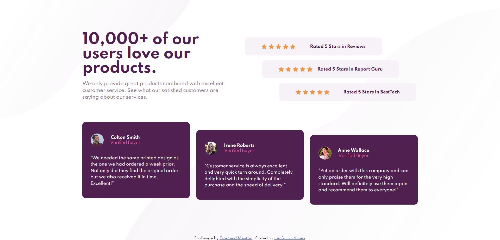

# Frontend Mentor - Social proof section solution

This is a solution to the [Social proof section challenge on Frontend Mentor](https://www.frontendmentor.io/challenges/social-proof-section-6e0qTv_bA). Frontend Mentor challenges help you improve your coding skills by building realistic projects.

## Table of contents

-   [Overview](#overview)
    -   [The challenge](#the-challenge)
    -   [Screenshot](#screenshot)
    -   [Links](#links)
-   [My process](#my-process)
    -   [Built with](#built-with)
    -   [What I learned](#what-i-learned)
    -   [Continued development](#continued-development)
    -   [Useful resources](#useful-resources)
-   [Author](#author)

## Overview

### The challenge

Users should be able to:

-   View the optimal layout for the section depending on their device's screen size

### Screenshot

### Links

-   Solution URL: (https://github.com/LeoSouzaNunes/social-proof-section-master)
-   Live Site URL: (https://leosouzanunes.github.io/social-proof-section-master/index.html)

## My process

### Built with

-   SASS
-   Flexbox
-   CSS Grid
-   CSS Custom properties

### What I learned

I was able to learn more about positioning multiples background images and apply some SASS resources such mixins and ifs to set some repetitive properties.

### Continued development

Through this project I realized that mobile first workflow can be very useful. Probably with better technique to wrap the desktop content the mobile version would have a better looking.

### Useful resources

-   [SASS Documentation](https://sass-lang.com/documentation/at-rules/control/if) - This helped me to build up mixins with different properties with few lines of code.
-   [W3 Schools](https://www.w3schools.com/cssref/pr_background-position.asp) - It was a very useful resource to clarify how to set two background images at the same element.

## Author

-   Frontend Mentor - [@LeoSouzaNunes](https://www.frontendmentor.io/profile/LeoSouzaNunes)
